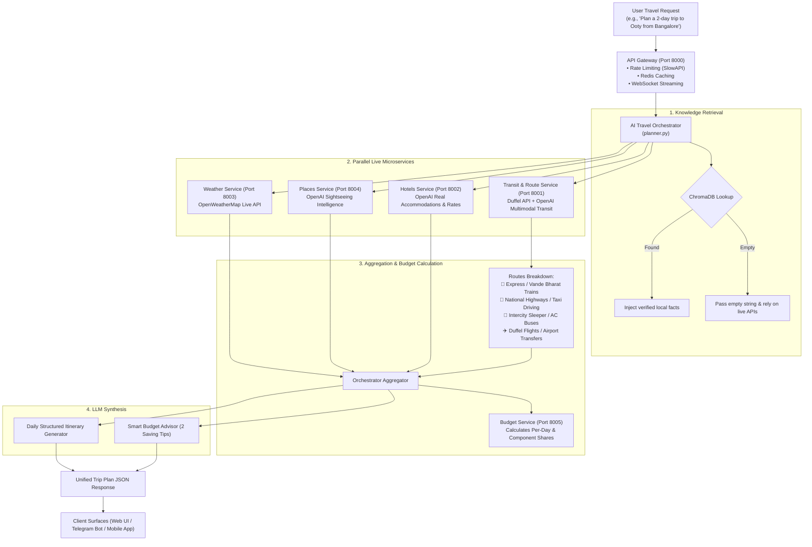

# AI Travel Orchestration — Comprehensive System Overview

## 1. System Philosophy & Architecture

The **AI Travel Orchestration Platform** dynamically composes multi-service workflows into a unified, realistic trip itinerary and logistics plan. 

### Core Tenet: Zero Hardcoded Catalogs
All travel data, meteorological forecasts, accommodations, attractions, and routes are generated dynamically through live third-party APIs and generative route intelligence:
- 🌤️ **OpenWeatherMap API**: Live weather conditions and 5-day predictive forecasts.
- ✈️ **Duffel API**: Real-time commercial flight offers and global airport IATA code resolution.
- 🤖 **OpenAI / Groq LLM Intelligence**: Dynamic multimodal transit planning (trains, driving highways, sleeper buses), authentic hotel rates, and verified sightseeing discovery.
- 📚 **ChromaDB Vector Store**: Retrieval-Augmented Generation (RAG) for deep localized destination insights.

---

## 2. End-to-End Workflow Diagram



---

## 3. Data Retrieval Mechanics (When ChromaDB Has No Data)

When destination data is not present in ChromaDB:
1. **RAG Context Layer (`rag/retrieval.py`):** ChromaDB returns an empty string (`""`) gracefully without raising an exception.
2. **Microservices Layer (`services/*`):** Live REST microservices are contacted in parallel over HTTP to fetch live data (OpenWeatherMap, Duffel, OpenAI/Groq).
3. **LLM Synthesis Layer (`orchestrator/planner.py`):** The LLM combines the live microservice responses with its internal parametric knowledge to draft the day-by-day plan.

---

## 4. Microservices Specification

| Service | Port | Endpoint | Primary Data Source | Description |
| :--- | :--- | :--- | :--- | :--- |
| **Gateway** | `8000` | `/plans/generate`, `/ws/plan` | FastApi, Redis | API routing, JWT auth, Redis cache, and WebSocket streaming. |
| **Transit & Flights** | `8001` | `GET /transit`, `GET /flights` | Duffel API & OpenAI | Multimodal routes (Train, Road, Bus, Flight) + live flight quotes. |
| **Hotels** | `8002` | `GET /hotels` | OpenAI / Groq | Verified real hotels, live average rates, ratings, and amenities. |
| **Weather** | `8003` | `GET /weather` | OpenWeatherMap API | Live temperature, conditions, humidity, wind, and 5-day forecast. |
| **Places** | `8004` | `GET /places` | OpenAI / Groq | Top-rated real attractions, categories, and visit durations. |
| **Budget** | `8005` | `POST /budget` | Mathematical Engine | Travel cost summation, percentage breakdown, and budget compliance. |
| **User & Auth** | `8006` | `/auth/*`, `/plans/*` | SQLite / PassLib | JWT user accounts and saved trip plans. |

---

## 5. Comprehensive Edge Cases Handled

### 1. State / Regional Queries (e.g. `Kerala`, `Goa Beach`)
- **Problem:** Queries referencing state names or descriptive terms instead of city names could cause geocoding mismatches or slicing errors.
- **Handling:** 
  - Hotel and Place services dynamically discover statewide/regional hubs (e.g., Kochi, Munnar, Kovalam for Kerala).
  - OpenWeatherMap performs fallback geocoding to regional centroids or major metropolitan hubs if simple city lookup fails.

### 2. Destinations Without Commercial Airports (e.g. `Ooty`, `Coorg`, `Hampi`)
- **Problem:** Previous systems generated synthetic flights between cities that physically have no airports.
- **Handling:**
  - The **Transit Service** evaluates multimodal options and highlights **Rail**, **Direct Highway Driving**, or **Intercity Sleeper Buses** as the recommended primary modes.
  - If flights are requested, it resolves the flight to the nearest airport (e.g., Coimbatore for Ooty) plus the necessary last-mile taxi transfer.

### 3. Identical Origin & Destination (e.g. `Goa` to `Goa`)
- **Problem:** Requesting transit for intra-city trips resulted in invalid flight searches.
- **Handling:**
  - Automatically detected and routed to intra-city transit (Cabs, Autos, Metro, Local Sightseeing Transfers).

### 4. Non-Integer and FastAPI Query Object Typing
- **Problem:** Slicing errors when query parameters (such as `limit=Query(5)`) were passed as non-integer objects.
- **Handling:**
  - All endpoints enforce explicit numeric coercion: `clean_limit = int(limit) if str(limit).isdigit() else 5` bounded safely between 1 and 20.

### 5. LLM JSON Structure Variations & Resilience
- **Problem:** LLMs occasionally wrap output in markdown fences, produce objects with `{ "hotels": [...] }` instead of raw arrays, or encounter transient API rate limits.
- **Handling:**
  - Regular-expression based robust JSON extraction (`extract_json_data`) parses raw arrays, wrapped dictionaries, and markdown fences.
  - Built-in dynamic fallback engines generate valid regional structures if the LLM is temporarily unreachable or rate-limited, preventing `500 Internal Server Error` responses.

---

## 6. Environment Variables Reference

Create a `.env` file in the project root:

```env
# LLM Provider Configuration
LLM_PROVIDER=openai
OPENAI_API_KEY=your_groq_or_openai_api_key

# External Live APIs
OPENWEATHER_API_KEY=your_openweathermap_api_key
DUFFEL_API_KEY=your_duffel_api_key

# Microservice Ports
ORCHESTRATOR_PORT=8000
FLIGHTS_SERVICE_URL=http://localhost:8001
HOTELS_SERVICE_URL=http://localhost:8002
WEATHER_SERVICE_URL=http://localhost:8003
PLACES_SERVICE_URL=http://localhost:8004
BUDGET_SERVICE_URL=http://localhost:8005
USER_SERVICE_URL=http://localhost:8006

# Infrastructure
REDIS_URL=redis://localhost:6379
JWT_SECRET_KEY=your_secure_random_jwt_secret
```

---

## 7. Running the System

### Start Backend Services
```powershell
python start_backend.py
```

### Start Frontend Application
```powershell
cd frontend
npm run dev
```
Open `http://localhost:3000` to interact with the responsive AI Travel Planner.
